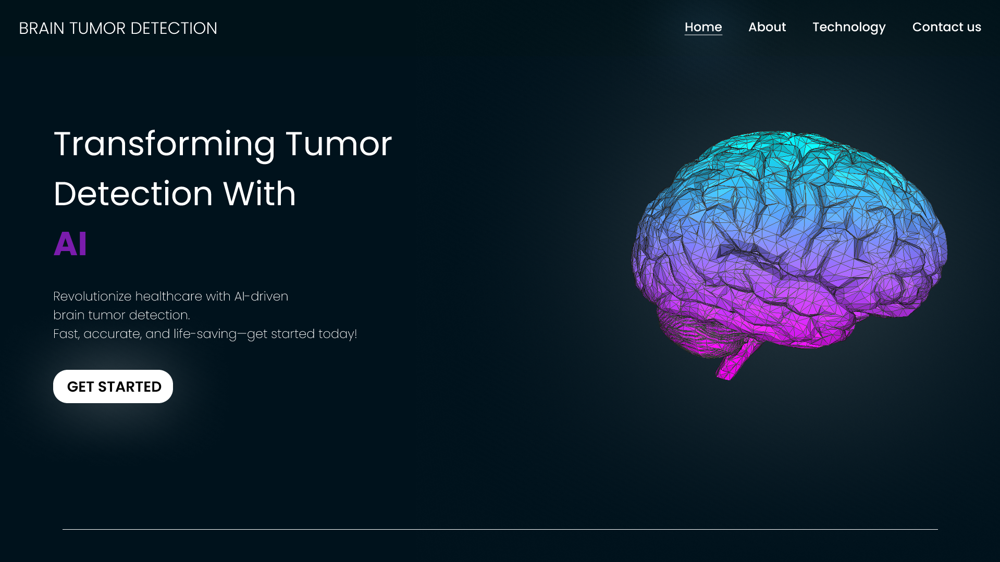

# Brain Tumor Detection

An AI-powered web application for detecting brain tumors from MRI scans using a Convolutional Neural Network (CNN).



## Features

- Upload and analyze brain MRI scans
- Real-time brain tumor detection using a CNN model
- Interactive visualization of detection results
- Responsive UI for desktop and mobile devices
- Secure and efficient image processing pipeline

## Tech Stack

### Frontend

- **Vite**: For fast development and optimized builds
- **React**: UI component library
- **Tailwind CSS**: For styling and responsive design

### Backend

- **Express.js**: Node.js server for handling API requests
- **Multer**: For file upload handling
- **Axios**: For communicating with Hugging Face API

### Machine Learning

- **Convolutional Neural Network (CNN)**: Custom-trained model for tumor detection
- **Hugging Face**: For model deployment and inference

## Installation

### Prerequisites

- Node.js (v14 or higher)
- npm or yarn
- Git

### Clone the Repository

```bash
git clone https://github.com/dead-shadow-7/brain-tumor-detection.git
cd brain-tumor-detection
```

### Frontend Setup

```bash
cd frontend
npm install
npm run dev
```

## Environment Variables

Create a `.env` file in the frontend directory:

```
VITE_BACKEND_URL=http://localhost:5000
```

### Backend Setup

```bash
cd backend
npm install
npm run dev
```

## Environment Variables

Create a `.env` file in the backend directory:

```
HUGGINGFACE_API_KEY=your_api_key_here (Optional if your model is private)

HF_SPACE=your_model_endpoint_here
```

## Usage

1. Open the link from the console
2. Upload a brain MRI scan (supported formats: JPEG, PNG)
3. Wait for the analysis to complete
4. View the detection results and confidence score

## API Endpoints

### POST /api/analyze

Accepts an MRI image and returns detection results.

**Request:**

- Method: POST
- Content-Type: multipart/form-data
- Body: form-data with key "image" containing the MRI scan file

**Response:**

```json
{
  "status": "success",
  "data": {
    "prediction": "Prediction: meningioma_tumor (Confidence: 1.00)",
    "timestamp": "2025-02-26T07:20:40.409Z"
  }
}
```

## Contributing

1. Fork the repository
2. Create your feature branch (`git checkout -b feature/amazing-feature`)
3. Commit your changes (`git commit -m 'Add some amazing feature'`)
4. Push to the branch (`git push origin feature/amazing-feature`)
5. Open a Pull Request

## License

This project is licensed under the MIT License - see the [LICENSE](LICENSE) file for details.

## Acknowledgments

- Dataset on [Kaggle](https://www.kaggle.com/datasets/masoudnickparvar/brain-tumor-mri-dataset/data)
